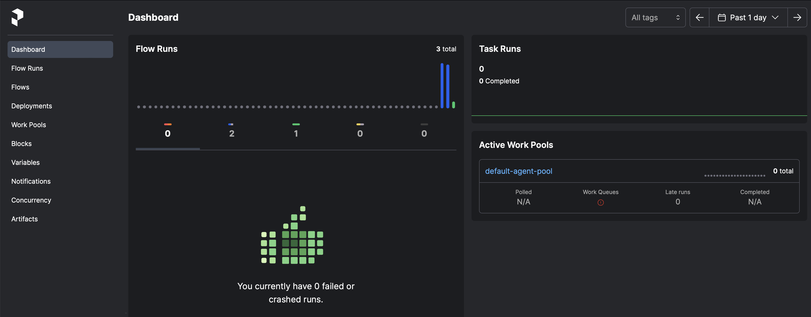
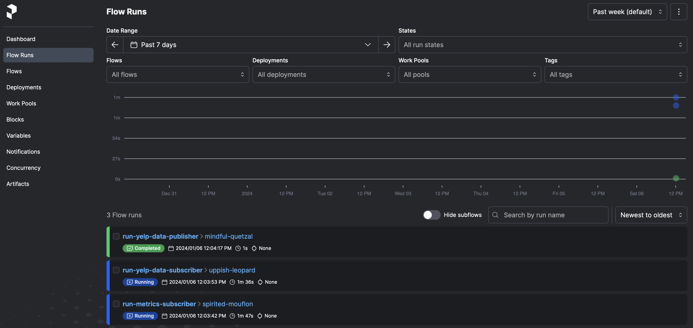
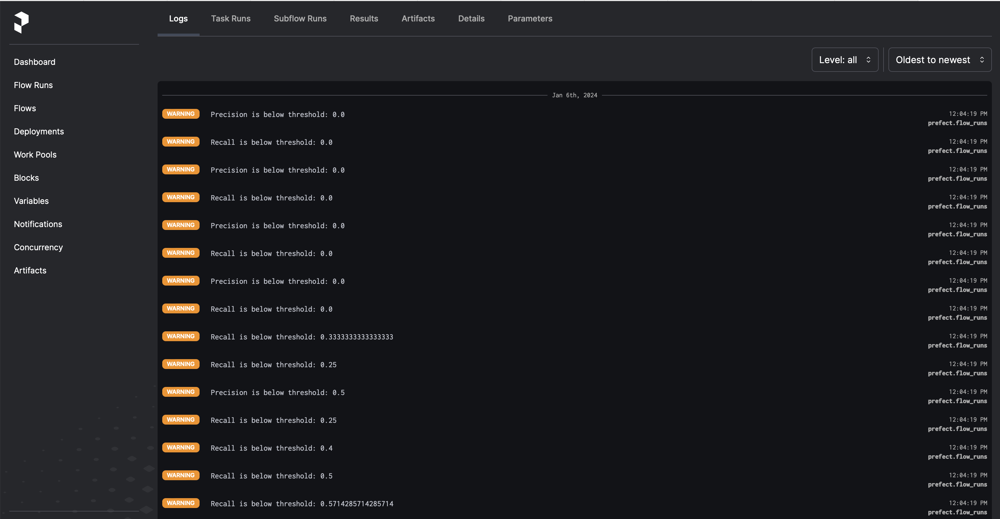

# prefect-example
Build, manage, and monitor your real-time machine learning application using Ensign, Prefect, and River.

This is an example of a real-time sentiment analysis application that ingests sample Yelp review data downloaded from [Kaggle](https://www.kaggle.com) and makes real-time predictions using [Ensign](https://rotational.io/ensign/) and [River](https://riverml.xyz/).

You have created the application but how do you manage and monitor it over time?  This is where [Prefect](https://www.prefect.io) comes in.  It is an extremely simple to use workflow orchestration platform.  All you have to do is install it using `pip` and then you can turn functions in your code to `Flows` that you can monitor in a dashboard.  You can either host a server locally within your own infrastructure or sign up for Prefect Cloud.

To use Ensign, create a free account on [rotational.app](https://rotational.app/).  You will need to do the following once you create an account:

- [Create a project.](https://youtu.be/VskNgAVMORQ)
- Add the following topics to the project: `river_pipeline`, `river_metrics`.  Check out this [video](https://youtu.be/1XuVPl_Ki4U) on how to add a topic.  You can choose your own names for the topic but make sure that you update the code accordingly.
- [Generate API keys for your project.](https://youtu.be/KMejrUIouMw)

You will need to create and source the following environment variables using the API keys you just downloaded:
```
export ENSIGN_CLIENT_ID="your client id here"
export ENSIGN_CLIENT_SECRET="your client secret here"
```

The sentiment analysis application consists of three components:
- `YelpDataPublisher` reads data from the `yelp.csv` file and publishes to the `river_pipeline` topic.  Note that this csv can easily be replaced by a real-time data source.  Check out Rotational Labs [Data Playground](https://github.com/rotationalio/data-playground) for examples!
- `YelpDataSubscriber` listens for new messages on the `river_pipeline` topic and loads and uses an online model that learns incrementally as it receives new training instances.  It also calculates the precision and recall scores which it publishes to the `river_metrics` topic.
- `MetricsSubscriber` listens for new messages on the `river_metrics` topic and checks to see if the precision or recall score are below a pre-specified threshold and prints the values if they fall below the threshold.

## Steps to run the application

### Create a virtual environment
```
$ virtualenv venv
```

### Activate the virtual environment
```
$ source venv/bin/activate
```

### Install the required packages
```
$ pip install -r requirements.txt
```

### Set up and start the Prefect server
You can either host your own Prefect server on your own infrastructure or use [Prefect Cloud](https://app.prefect.cloud/).  Follow the instructions after signing up to create a Prefect server on the cloud.  

If you choose to set up a local server, you simply need to open up a terminal window and run the following command to get started. Make sure that prefect is installed in your virtual environment first.
```
$ prefect server start
```

### Open three more terminal windows

#### Run the MetricsSubscriber in the first window (make sure to activate the virtual environment first)
```
$ source venv/bin/activate
```

```
$ python river_sentiment_analysis.py metrics
```

#### Run the YelpDataSubscriber in the second window (make sure to activate the virtual environment first)
```
$ source venv/bin/activate
```
```
$ python river_sentiment_analysis.py subscribe
```

#### Run the YelpDataPublisher in the third window (make sure to activate the virtual environment first)
```
$ source venv/bin/activate
```
```
$ python river_sentiment_analysis.py publish
```

You can then take a look at the dashboard to view your jobs.  It will look something like this:



Here is a view of the Flow runs:



You can also check the logs for warnings and errors:

